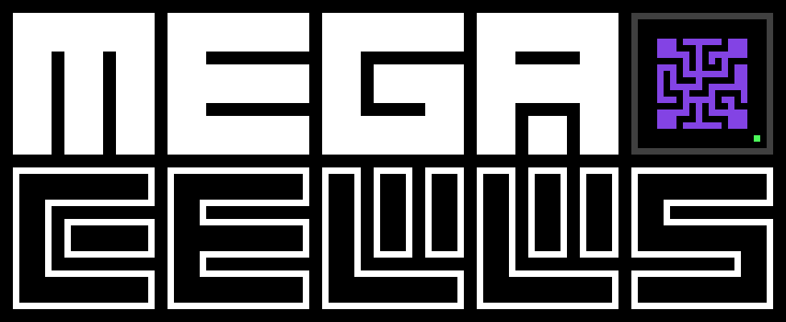

---
navigation:
  title: "Add-on: MEGA Cells"
  position: 150
---

# MEGA Cells

# Introduction

MEGA Cells is an add-on for AE2 which chiefly, among other things, provides higher tiers of storage, ranging in capacity
from 1M to as high as 256M, similarly to add-ons of old such as Extra Cells 2 and its successors.

Unlike previous conventional add-ons in the same vein, MEGA does things quite differently, featuring its own dedicated
progression line and components to further augment and challenge existing AE2 players' set-ups, while emphasising a
distinct visual style with far darker, almost jet-black colour schemes.

*\[Guidebook section is currently WIP.]*
